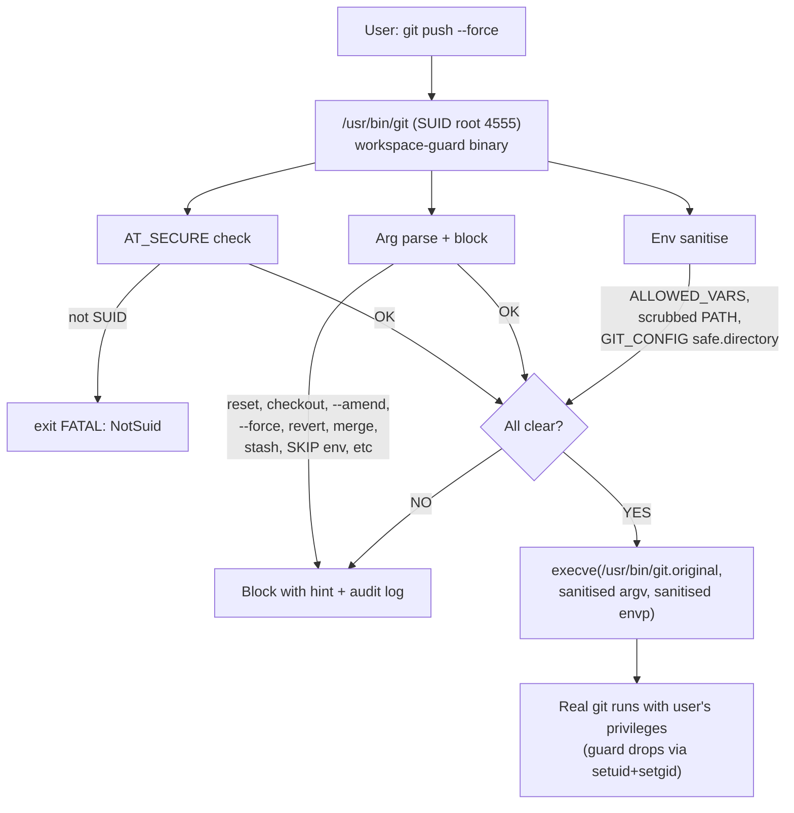

# WORKSPACE-GUARD — SUID Guard Framework (Git PoC)

**Compiled root privilege enforcement for git.**  
Replaces PATH-based bash wrappers with an **unbypassable SUID-root binary**.

## Why

Traditional git guards (bash wrappers, pre-commit hooks) are readable, editable, and trivially bypassed — just run `git` directly or unset the wrapper. WORKSPACE-GUARD solves this by:

1. Installing a **compiled Rust binary** as `/usr/bin/git` with **SUID root (4555)**
2. Relocating the real git to `/usr/bin/git.original` (mode **0700 root:root** — unreadable and unexecutable by anyone but root)
3. Guarding all arguments in compiled code **before** `execve()`-ing the real binary
4. Sanitizing the execution environment (restricted env vars, scrubbed PATH, blocked dangerous `-c` config keys)

The user cannot bypass the guard because they cannot read, modify, or directly execute `/usr/bin/git.original`.

## Architecture



## Blocked Operations

| Subcommand | Reason |
|-----------|--------|
| `git reset` | Destructive — discards work |
| `git checkout` | Destructive — can overwrite working tree |
| `git clean` | Destructive — removes untracked files |
| `git restore` | Destructive — overwrites working tree |
| `git rm` | Destructive — removes files from index + disk |
| `git rebase` | Rewrites history |
| `git gc` / `git prune` | Repository maintenance (unsafe under guard) |
| `git commit --amend` | Rewrites history (immutable policy) |
| `git push --force` / `-f` | Rewrites remote history |
| `git branch -D` | Force-deletes unmerged branches |
| `git stash drop` / `git stash clear` | Destructive to stash stack |
| `git revert` (unpushed commits) | Invasive to un-pushed work |
| `git pull` (protected branch, no `--ff-only`/`--rebase`) | Creates merge commits |
| `git merge` (protected branch, no `--ff-only`) | Creates merge commits |

## Requirements

| Check | What it blocks |
|-------|---------------|
| `AT_SECURE` | Guard refuses to run if not invoked as SUID (exits with `FATAL: NotSuid`) |
| Null bytes in args | Blocks injection via `\0` in arguments |
| `--no-verify` | Prevents hook bypass |
| `--hard` flag | Blocks any command with `--hard` |
| Dangerous `-c` keys | Blocks `core.hookspath`, `core.sshcommand`, `credential.helper`, `http.proxy`, `protocol.allow`, `safe.directory`, and 7 more |
| SKIP / PRE_COMMIT_ALLOW_NO_CONFIG env | Blocks hook-bypass environment variables |
| Background `git push` | Blocks push from non-foreground process groups |
| AMI-CI quality contract | Runs `checks_quality.sh` before `commit` and `push` |

## Deployment

```bash
# From the workspace root (AMI-AGENTS):
sudo make pre-req

# This will:
#   1. Build the Rust binary (debug or release)
#   2. Relocate /usr/bin/git → /usr/bin/git.original (0700 root:root)
#   3. Install guard as /usr/bin/git (4555 SUID root)
#   4. Set up dpkg-divert to protect from apt overwrites
#   5. Set immutable attributes (+i) on both binaries
#   6. Register apt post-invoke hook for change detection
#   7. Restrict alternate git binaries (/snap/bin/git, /usr/local/bin/git)

# Uninstall:
sudo make pre-req --uninstall-workspace-guard

# Verify:
sudo make pre-req --check-workspace-guard
```

## Development

```bash
# Build (debug)
cargo build

# Build (release, stripped, LTO, abort-on-panic)
cargo build --release

# Run tests (note: tests verify NotSuid exit — guard can't exercise
# full logic without SUID install)
cargo test

# Lint
cargo fmt --all -- --check
cargo clippy --workspace --all-targets -- -D warnings

# AMI-CI compliance audit
make compliance
```

## Project Structure

```
WORKSPACE-GUARD/
├── Cargo.toml              # Single dependency: libc
├── Makefile                # Build, test, lint, compliance targets
├── .pre-commit-config.yaml # AMI-CI + Rust hooks
├── quality_exceptions.yaml # AMI-CI compliance
├── config/
│   ├── banned_words_exceptions.yaml
│   ├── coverage_thresholds.yaml
│   └── sensitive_files_exceptions.yaml
├── src/
│   ├── main.rs             # Entry point, ALLOWED_VARS, BLOCKED_SUBCOMMANDS
│   ├── args.rs             # Argument parsing, null-byte check, -c flag validation
│   ├── exec.rs             # AT_SECURE check, execve, AMI-CI contract check
│   ├── block.rs            # Blocked subcommand logic
│   └── log.rs              # Block audit logging to ~/.workspace-guard.log
├── tests/
│   └── integration_test.rs # Non-SUID operation tests
└── README.md
```

## Security Properties

1. **Compiled enforcement**: The guard logic is not readable or editable by users
2. **No privilege escalation**: After validation, guard calls `setuid(uid)` before `execve` — real git runs as the user, not root
3. **Immutable binaries**: Both `/usr/bin/git` and `/usr/bin/git.original` have `chattr +i` to prevent tampering
4. **dpkg-divert protected**: `apt` cannot overwrite the guard — divert redirects to `git.distrib`
5. **Scrubbed environment**: Only whitelisted env vars survive to `execve`; `PATH` is hardcoded; dangerous `-c` keys blocked
6. **Audit trail**: Every block is logged to `~/.workspace-guard.log` with timestamp, cwd, uid, and reason

## Framework vs PoC

WORKSPACE-GUARD is designed as a **framework** for hardening SUID access to any tool. The initial PoC targets `git`, but the architecture supports extending to other binaries (ssh, rsync, make, etc.) by creating separate guard crates with their own allow/block lists.

## License

Internal. Independent AI Labs.
